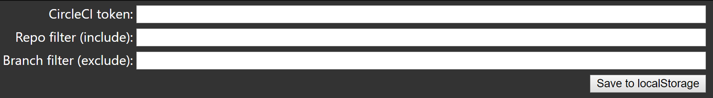

# Build status dashboard for CircleCI

## Usage

The dashboard uses an API token on CircleCI to access build information.

To set that up goto CircleCI and login with a user that can be used as master for the build dashboard.

Note! Any project "followed" by that user in CircleCI will be shown on the dashboard (unless filtered).

Goto "User settings" -> "Personal API Tokens" and create a new token.

Now go to the deployed dashboard http://some-web-site/some-path/#/config

Input the token in the "CircleCI token" field, and save.

Now reload without the /config path and a dashboard should be showing up...

###  `Configuration storage`

Currently the app stores the configuration settings in localStorage on the browser.
This has the advantage that nothing is stored on the web site, so authentication isn't needed.
It has the drawback that any given browser can only connect to one account (one API key)

### `Filtering`

On the configuration page there are fields for filtering repos and branches.
These settings are stored in localStorage on the browser, and is used for all browser windows.

Anything typed in these fields are interpreted as regular expressions.

Filtering on repos includes matches, and on branches are excluded.

It is also possible to use special paths for filtering. This enables a multi screen setup.
These take precedence over settings from the configuration page.

There are 3 paths for filtering:

1. /repos/<repo name regular expression> (includes matches)
2. /branches/<branch name regular expression> (excludes matches)
3. /filter/<repo name regular expression>/<branch name regular expression> (same include, exclude behavior as above)

## Available Scripts

In the project directory, you can run:

### `yarn`

Resolves dependencies and downloads needed dependencies. Needs to be run before any of the commands below.

### `yarn start`

Runs the app in the development mode. 
Open [http://localhost:3000](http://localhost:3000) to view it in the browser.

The page will reload if you make edits. 
You will also see any lint errors in the console.

### `yarn test`

Launches the test runner in the interactive watch mode. 
See the section about [running tests](https://facebook.github.io/create-react-app/docs/running-tests) for more information.

### `yarn lint`

Will run eslint on the code base. Currently checking for mixed space and tab characters and other default settings.

### `yarn build`

Builds the app for production to the `build` folder. 
It correctly bundles React in production mode and optimizes the build for the best performance.

The build is minified and the filenames include the hashes. 
Your app is ready to be deployed!

See the section about [deployment](https://facebook.github.io/create-react-app/docs/deployment) for more information.

## Learn More

To learn React, check out the [React documentation](https://reactjs.org/).

This project was bootstrapped with [Create React App](https://github.com/facebook/create-react-app).
